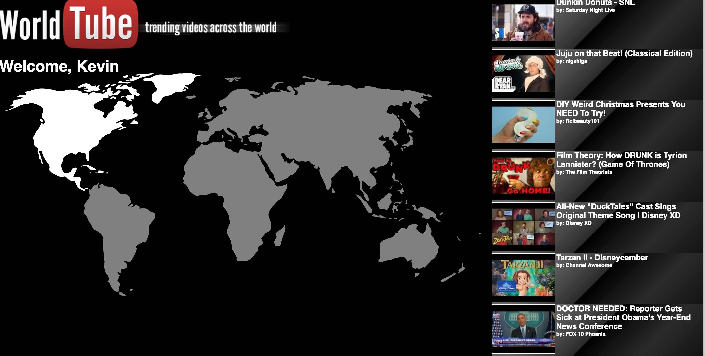
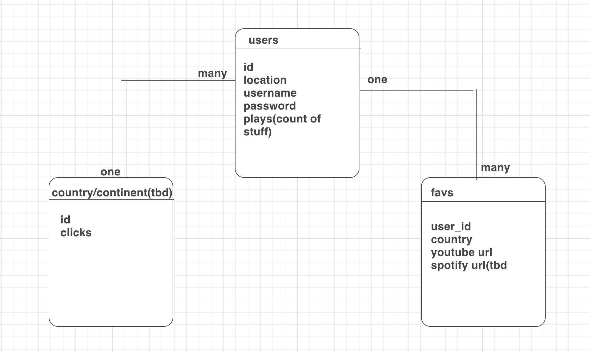
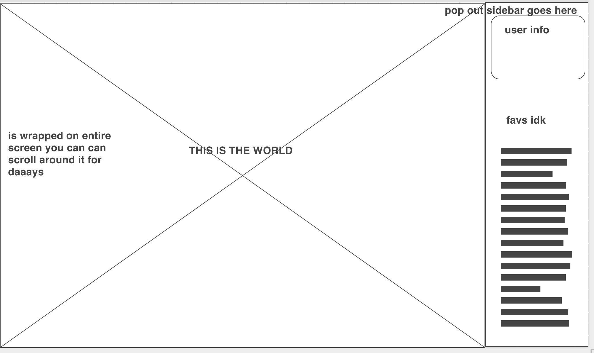

# World Tube - find out whats trending across the world.
## So, no living human being ever has used the trending tab on youtube..
    Its pull of paid promotional crap and theres no quick way to check for each country

    this app changes the game.
    try it at https://worldtube.herokuapp.com/

WorldTube lets you click on any region (SOON TO BE COUNTRY) and pull their trending videos strictly based on their clicks over time in a certain release window. Don't let your memes be dreams friends.

#User stories:
As a user i want to be able to quickly retrieve lists of videos trending
As a user i want to be able to take advantage of visual input via click, typing is boring
As a user i want to be able to view the pull videos (tbd heroku destroying react-youtube module)
As a user i want charts and other forms of data representation to show trends.

#General Approach:
 I tried to get an svg file where if click can pass a value to the youtube api fetch which populates a list on the right side of the application. the app makes 2 api calls because the youtube data is pretty big and is stored in different parts such as "snippet" and "statistics"
 the list items are clickable and fornow log the video ID which was being passed into react-youtube(npm module) which then opens the video for view.
#ERD:

#Blueprints:

##Problems,challenges and mid-implementation endeavors:
   - The spotify API proved impossible to use after the discovery that their "charts api" was taken down with no notice of coming back. Proved very difficult to find a way determine whats trending and started to seem like a bad time investment wen coupled with setting up spotify OAUTH

   - React also proved to be a challenge what it came to rendering a couple of styles of worldmaps which were SVG files. Bobby king helped me immensely by finding a bunch of code off an svg module i was struggling with (react-world-map). In hindsight, while rending each object would be a nightmare, EJS might have been a better choice for what i was trying to achieve. A bigger svg file with countries is in the works at the moment.(the youtube api takes country input which can lead to something amazing.)

   - Currently fixing react-youtube the user will be able to click on the youtube item on a list and it will pop open a modal with the video to play.

   - Some CRUD features. As this app evolved and made changes, I felt it actually became an even better idea. So much that i wanted to focus on the logistics and visual representation of the videos rather than the usual "save your favorites friend" functionality. that stuff is under the hood and good to go, but i'd rather it go in the direction where i can show a world ranking and a data chart showing a trending videos lifecycle mid-trend.

### Technology Used
- [PG-Promise](https://github.com/vitaly-t/pg-promise)
  * To connect our PostgresSQL database
- [Express.js](https://expressjs.com/)
  * framework used for our API server
- [React.js](https://facebook.github.io/react/)
  * Client side library for our view layer
- [Webpack](http://webpack.github.io/docs/)
  * Application bundler used for our React client
- [Dotenv](https://github.com/motdotla/dotenv)
  * Loads `ENV` variables from a `.env` file
- [CSS Modules](https://github.com/css-modules/css-modules) - [Demo of CSS Modules with Webpack](https://github.com/css-modules/webpack-demo)

### Special Thanks
[Bobby King](@gittheking) for the PERN_template
Webpack configuration inspired by [Jason Seminara](@jasonseminara)'s [React To Do Application](https://github.com/jasonseminara/react_to-do)
